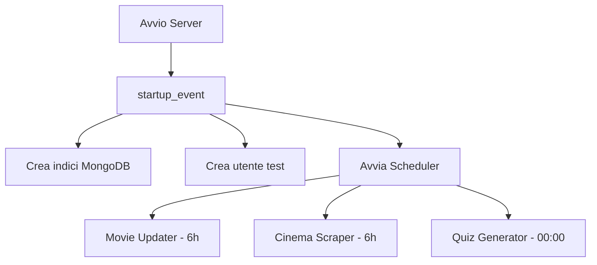
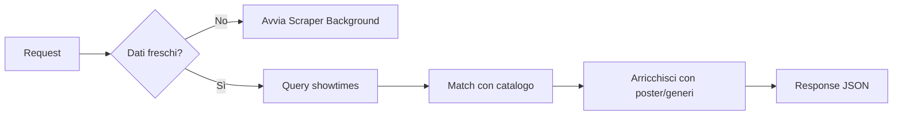
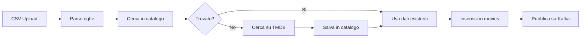
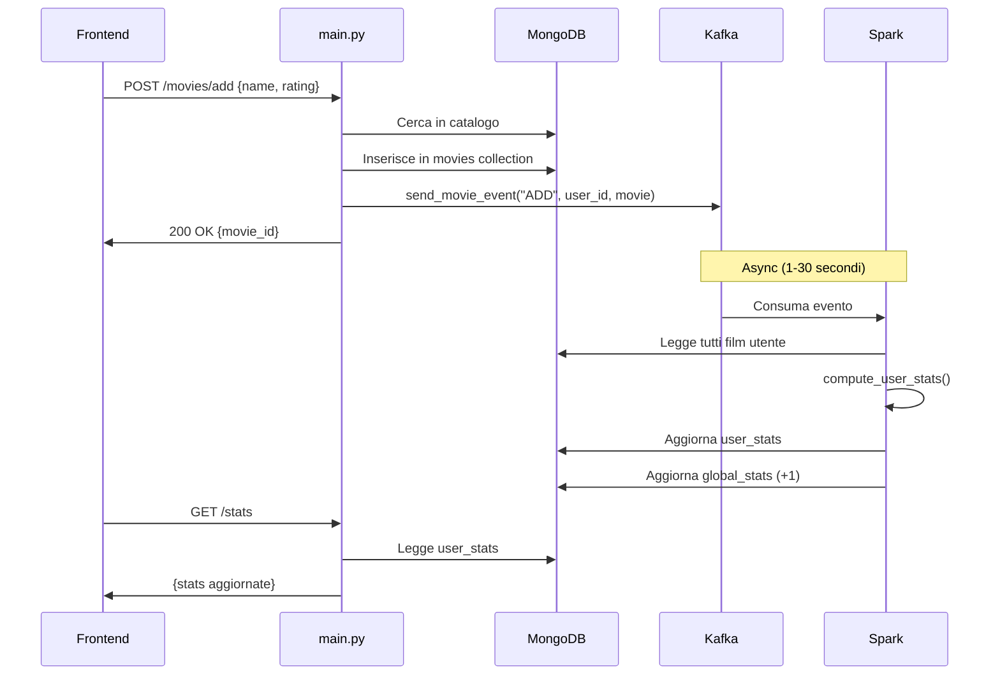

# CineMatch Backend API - Documentazione Completa

## Panoramica

Il file `main.py` è il cuore del backend CineMatch, un'API FastAPI che gestisce:
- Autenticazione utenti
- Gestione film watchlist
- Statistiche utente (via Spark)
- Trend globali community
- Quiz giornalieri AI
- Programmi cinema
- Raccomandazioni personalizzate
- Ricerca catalogo (MongoDB + Elasticsearch)
- Dashboard admin (Grafana)

---

## Struttura del File

```
main.py (~2600 righe)
├── Configurazione e Import (1-70)
├── Helper Functions (71-108)
├── Pydantic Models (109-132)
├── Startup Event (137-348)
├── Auth Endpoints (357-536)
├── Cinema Endpoints (537-959)
├── Data Endpoints (960-2031)
├── Sentiment Endpoints (2032-2066)
├── Catalog Endpoints (2080-2346)
├── Admin Stats Endpoints (2347-2436)
└── Quiz AI Endpoints (2437-2629)
```

---

## Configurazione Iniziale

### Connessioni Database

```python
# MongoDB
MONGO_URL = os.getenv("MONGODB_URL", "mongodb://localhost:27017")
client = MongoClient(MONGO_URL)
db = client.cinematch_db

# Collections principali
movies_collection = db.movies          # Film utenti (watchlist)
users_collection = db.users            # Utenti registrati
stats_collection = db.user_stats       # Statistiche calcolate da Spark
movies_catalog = db.movies_catalog     # Catalogo film completo
showtimes_collection = db.showtimes    # Programmazioni cinema

# Elasticsearch
ES_URL = os.getenv("ELASTICSEARCH_URL", "http://elasticsearch:9200")
es_client = Elasticsearch(ES_URL)
```

### Kafka Producer

```python
from kafka_producer import KafkaEventProducer
kafka_producer = KafkaEventProducer()
```

Usato per pubblicare eventi quando un utente aggiunge/modifica/elimina film.

---

## Helper Functions

### `normalize_title(text: str) -> str`
Normalizza i titoli per matching fuzzy (rimuove accenti, punteggiatura).

```python
normalize_title("Città d'Ombra")  # → "citta d ombra"
```

### `mongo_to_dict(obj)`
Converte ObjectId MongoDB in stringhe per serializzazione JSON.

---

## Startup Event

### `startup_event()`
Eseguito all'avvio dell'applicazione. Configura:

1. **Indici MongoDB** per performance query
2. **Utente di test** (pasquale.langellotti)
3. **Scheduler APScheduler** per task periodici:
   - `scheduled_movie_updater()` - Aggiorna metadati film ogni 6 ore
   - `scheduled_cinema_pipeline()` - Scrape cinema ogni 6 ore
   - `scheduled_quiz_generation()` - Genera quiz alle 00:00



---

## Auth Endpoints

### `POST /register`
Registra nuovo utente con password hashata (bcrypt).

### `POST /login`
Autentica utente, ritorna JWT token.

### `GET /me`
Ritorna dati utente corrente (richiede auth).

### `POST /avatar`
Upload avatar (file o URL preset).

### `GET /preset-avatars`
Lista avatar predefiniti (personaggi iconici cinema).

---

## Cinema Endpoints

### `GET /cinema/dates`
Date disponibili con film in programmazione per la provincia utente.

### `GET /cinema/films`
Film in programmazione con matching robusto al catalogo.



### `POST /cinema/refresh`
Forza refresh dati cinema (scrape + sync).

### `GET /cinema/provinces`
Lista province disponibili.

### `GET /cinema/status`
Stato corrente dello scraper.

---

## Data Endpoints (Film Utente)

### `POST /movies/add` 
Aggiunge film alla watchlist → **Pubblica evento Kafka**.

```python
# Dopo l'inserimento in MongoDB:
kafka_producer.send_movie_event("ADD", user_id, movie_data)
```

### `DELETE /movies/remove`
Rimuove film → **Pubblica evento DELETE su Kafka**.

### `PUT /movies/update`
Aggiorna rating/commento → **Pubblica evento UPDATE su Kafka**.

### `GET /movies`
Lista film utente con poster dal catalogo.

### `POST /upload-csv`
Importa watchlist da CSV Letterboxd.



---

## Statistiche Endpoints

### `GET /stats`
Ritorna statistiche utente calcolate da Spark.

```python
# Legge da user_stats (popolato da Spark)
stats = db.user_stats.find_one({"user_id": user_id})
return stats.get("stats", {})
```

### `GET /trends/global`
Ritorna trend globali (top 10 film, generi trend).

```python
# Legge da global_stats (popolato da Spark Streaming)
trends = db.global_stats.find_one({"type": "global_trends"})
return {
    "top_movies": trends.get("top_movies", []),
    "trending_genres": trends.get("trending_genres", [])
}
```

### `POST /recalculate-stats`
Forza ricalcolo statistiche via Kafka.

```python
kafka_producer.send_movie_event("RECALCULATE", user_id, {})
```

### `GET /monthly-stats/{year}`
Statistiche mensili per anno (da `year_data` in user_stats).

---

## Recommendations Endpoint

### `GET /recommendations`
Raccomandazioni personalizzate basate sul profilo utente.

```python
from recommendation_service import RecommendationService
service = RecommendationService(db)
recommendations = service.get_recommendations(user_id)
```

Ritorna:
- 6 film raccomandati (match con gusti utente)
- 3 film NON raccomandati (fuori dai gusti)

---

## Catalog Endpoints

### `GET /catalog`
Lista film dal catalogo con filtri (genere, anno, rating).

### `GET /catalog/{imdb_id}`
Dettagli singolo film.

### `GET /catalog/search?q=...`
Ricerca per titolo (italiano, inglese, originale).

### `POST /catalog/advanced-search`
Ricerca avanzata via Elasticsearch.

```python
# Permette di specificare i campi
{
    "query": "Nolan",
    "fields": ["director", "title"]
}
```

### `GET /catalog/genres`
Lista generi disponibili.

### `GET /catalog/stats`
Statistiche catalogo (totale film, per genere, per anno).

---

## Admin Stats Endpoints (Grafana)

Endpoint senza autenticazione per Grafana Infinity plugin.

### `GET /admin/stats`
Statistiche globali (utenti, film, medie).

### `GET /admin/users`
Lista utenti per tabella.

### `GET /admin/genres`
Distribuzione generi per grafico a torta.

### `GET /admin/activity`
Attività giornaliera per time series.

---

## Quiz AI Endpoints

### `GET /quiz/questions?n=5`
Ottiene n domande per il quiz giornaliero.

### `POST /quiz/generate`
Genera nuove domande usando Ollama (background).

### `GET /quiz/status`
Stato generazione quiz.

### `POST /quiz/submit`
Invia risultato quiz.

### `GET /quiz/history`
Cronologia quiz utente.

---

## Flusso Dati: Aggiunta Film



---

## Modelli Pydantic

### Request Models

| Model | Campi | Endpoint |
|-------|-------|----------|
| `UserAuth` | username, password | /login |
| `UserRegister` | username, password, email, ... | /register |
| `MovieCreate` | name, year, rating, date, review | /movies/add |
| `AddMovieRequest` | name, year, rating, comment, imdb_id | /movies/add-to-collection |
| `UpdateMovieRequest` | name, year, rating, comment | /movies/update |
| `RemoveMovieRequest` | name, year | /movies/remove |
| `QuizSubmission` | correct, wrong, quiz_date | /quiz/submit |
| `AdvancedSearchRequest` | query, fields | /catalog/advanced-search |

---

## Dipendenze Esterne

| Servizio | Uso | Variabile Env |
|----------|-----|---------------|
| MongoDB | Database principale | `MONGODB_URL` |
| Kafka | Event streaming | `KAFKA_BOOTSTRAP_SERVERS` |
| Elasticsearch | Ricerca avanzata | `ELASTICSEARCH_URL` |
| TMDB API | Metadati film | `TMDB_API_KEY` |
| Ollama | Generazione quiz AI | `OLLAMA_HOST` |

---

## Sicurezza

- **JWT Token** per autenticazione
- **bcrypt** per hash password
- **CORS** configurato per frontend localhost
- **Depends(get_current_user_id)** per proteggere endpoint

---

## Performance Ottimizzazioni

1. **Indici MongoDB** creati allo startup
2. **Batch lookup** catalogo con `$in`
3. **Background tasks** per operazioni lunghe (scraping, generazione quiz)
4. **Kafka async** per non bloccare le risposte API
5. **Elasticsearch** per ricerca full-text performante
