# Capitolo 2: Calcolo delle Statistiche con Apache Spark e Kafka

Il sistema utilizza un'architettura ibrida basata su **Apache Spark Structured Streaming** per calcolare in tempo reale sia le statistiche personali dei singoli utenti (`User Stats`) sia i trend globali della piattaforma (`Global Stats`).

Questa sezione approfondisce i dettagli implementativi del flusso di dati, partendo dall'importazione massiva via CSV fino all'elaborazione streaming con il concetto di "Lazy Evaluation".

## 2.1 Importazione Storico da File CSV

Il primo punto di ingresso dei dati nel sistema è spesso rappresentato dallo storico film dell'utente (es. export da Letterboxd). CineMatch implementa una pipeline specifica per gestire l'ingestione massiva di questi dati senza bloccare il sistema.

### Flusso di Ingestione CSV
1.  **Lettura e Parsing**: Il Backend (`main.py`) rileva la presenza di un file `ratings.csv` montato nel volume Docker. Il file viene letto e convertito in una lista di dizionari Python.
2.  **Reset Preventivo**: Per evitare duplicazioni durante un re-import, il sistema azzera le statistiche *user-specific* su MongoDB (`user_stats` e `user_affinities`).
3.  **Invio Evento Batch a Kafka**:
    Invece di scrivere direttamente nel database, il Backend agisce da *Producer Kafka*, inviando un singolo evento di tipo `BULK_IMPORT` (o un batch di eventi `ADD`) al topic `user-movie-events`.
    
    ```python
    # Backend -> Kafka
    kafka_producer.send_batch_event("BULK_IMPORT", user_id, movies_list)
    ```
    
4.  **Consumo tramite Spark**:
    Spark, che è in ascolto sullo stesso topic, riceve questi eventi. Grazie alla logica incrementale del processore (`spark_stats_processor.py`), tratta l'importazione massiva esattamente come una serie di interazioni singole, aggiornando le statistiche in tempo reale.

Questa architettura disaccoppia l'importazione (lenta e pesante) dal calcolo delle statistiche, delegando a Spark il carico computazionale.

---

## 2.2 Lazy Evaluation in Spark Streaming

Una caratteristica fondamentale di Spark è la **Lazy Evaluation** (valutazione pigra). Quando definiamo le trasformazioni sui dati, Spark non le esegue immediatamente, ma costruisce un **Piano di Esecuzione Logico** (DAG - Directed Acyclic Graph).

Nel nostro sistema:

1.  **Definizione (Lazy)**:
    ```python
    # 1. Lettura da Kafka: definisce solo la SORGENTE, non scarica ancora dati
    df = spark.readStream.format("kafka")...
    
    # 2. Trasformazione: definisce lo schema JSON da applicare
    parsed_df = df.select(from_json(col("value").cast("string"), event_schema)...)
    
    # 3. Proiezione: seleziona solo i campi necessari
    user_events_df = parsed_df.select("user_id", "events")
    ```
    In questa fase, **nessun dato ha ancora attraversato il cluster**. Spark ha solo memorizzato le istruzioni.

2.  **Esecuzione (Eager)**:
    L'elaborazione effettiva viene scatenata solo quando un'azione di output ("Sink") viene avviata.
    ```python
    # L'azione writeStream avvia il motore di streaming
    query = user_events_df.writeStream \
        .foreachBatch(process_batch) \  # Trigger dell'elaborazione fisica
        .start()
    ```
    Solo ora Spark ottimizza il piano (Catalyst Optimizer) e inizia a consumare i micro-batch da Kafka.

---

## 2.3 Calcolo Statistiche Singolo Utente (User Stats)

Il calcolo delle statistiche personali avviene nella funzione `process_partition_incremental`. Questa funzione è progettata per essere **idempotente** e **incrementale**, processando solo il "delta" (i nuovi eventi) senza dover rileggere l'intero storico dell'utente.

### Flusso Logico (O(1) Complexity)
Per ogni micro-batch di eventi ricevuto da Kafka:

1.  **Raggruppamento in-memory**: Spark raggruppa gli eventi per `user_id` all'interno del batch corrente.
2.  **Catalog Lookup Ottimizzato**:
    *   Invece di fare una query al DB per ogni film (lento, N query), il sistema estrae tutti i titoli unici nel batch.
    *   Effettua **una singola query** a `movies_catalog` per recuperare i metadati (regista, generi, attori) di tutti i film coinvolti.
3.  **Calcolo Incrementale**:
    *   Vengono calcolati i delta: `+1` per un film visto, `-1` per un film rimosso.
    *   Vengono aggiornati i totali parziali (es. `sum_ratings += 5`).
4.  **Bulk Write su MongoDB**:
    *   Utilizza operazioni atomiche `$inc` (Mongo Update Operators) per aggiornare il database.
    *   Questo garantisce coerenza anche in caso di scritture concorrenti.

### Schema Dati MongoDB

I dati sono distribuiti su due collezioni per performance ottimali:

#### A. Collezione `user_stats` (Metriche Globali)
Contiene solo i contatori aggregati ad alto livello.
```json
{
  "_id": ObjectId("..."),
  "user_id": "pasquale.langellotti",
  "total_watched": 142,
  "sum_ratings": 580,        // Somma voti (per calcolare media = sum/total)
  "watch_time_minutes": 16800,
  "rating_distribution": {
    "1": 2, "2": 5, "3": 20, "4": 50, "5": 65
  },
  "stats_version": "6.0_flat_affinities",
  "updated_at": "2024-01-24T16:00:00+01:00"
}
```

#### B. Collezione `user_affinities` (Dettagli Granulari)
Utilizza una **struttura piatta** ("Flat Structure") dove ogni preferenza (regista, attore, genere) è un documento separato. Questo evita il limite di dimensione dei documenti BSON (16MB) che si raggiungerebbe nidificando tutto nell'utente.

```json
{
  "_id": "pasquale.langellotti_director_Christopher_Nolan",
  "user_id": "pasquale.langellotti",
  "type": "director",         // Tipi: director, actor, genre
  "name": "Christopher Nolan",
  "name_key": "Christopher_Nolan",
  "count": 12,                // Numero film visti di questo regista
  "sum_voti": 54,             // Somma voti dati a questo regista
  "updated_at": "..."
}
```

---

## 2.4 Calcolo Statistiche Globali (Global Stats)

Il calcolo dei trend globali (es. "Top 10 Film più visti") è gestito dalla funzione `write_global_trends_to_mongo`.

### Doppia Modalità di Esecuzione
Spark opera in due modalità per garantire consistency:

1.  **Bootstrap (Batch)**: All'avvio, una funzione one-off (`bootstrap_global_stats`) legge l'intero storico da MongoDB per inizializzare i contatori. Questo è necessario perché Kafka trattiene i dati solo per un periodo limitato (Retention Policy).
2.  **Streaming (Incrementale)**: Successivamente, Spark processa solo i nuovi eventi in arrivo da Kafka, aggiornando i contatori in memoria e persistendo i risultati.

### Logica di Aggiornamento
Per ogni batch di eventi:
1.  **Read-Modify-Write**:
    *   Legge lo stato attuale da `global_stats`.
    *   Applica i cambiamenti (+/- 1 agli spettatori di un film).
2.  **Ricalcolo Classifiche**:
    *   Ordina i film per numero di visualizzazioni.
    *   Estrae la Top 10.
3.  **Persistenza**: Salva il documento aggiornato.

### Schema Dati MongoDB (`global_stats`)
Un singolo documento contiene l'istantanea attuale dei trend.

```json
{
  "_id": ObjectId("..."),
  "type": "global_trends",
  "total_movies_analyzed": 15000,
  "top_movies": [
    {
      "title": "Oppenheimer",
      "count": 450,
      "poster_path": "https://image.tmdb.org/..."
    },
    {
      "title": "Barbie",
      "count": 410,
      "poster_path": "..."
    }
    // ... altri 8 film
  ],
  "trending_genres": [
    { "genre": "Drama", "count": 1200, "percentage": 25.5 },
    { "genre": "Sci-Fi", "count": 800, "percentage": 15.2 }
  ],
  "updated_at": "2024-01-24T16:05:00+01:00"
}
```

---

## 2.5 Diagrammi di Flusso e Schema Eventi

### 📊 Flusso Dati: User Stats (Statistiche Personali)

Il seguente diagramma illustra come un'interazione utente (visione o voto di un film) si trasforma in statistiche persistenti:

```mermaid
flowchart LR
    subgraph Frontend
        A[👤 Utente]
    end
    
    subgraph Backend [Backend FastAPI]
        B[API Endpoint<br/>/movies/add]
        C[kafka_producer.py<br/>send_movie_event]
    end
    
    subgraph MessageBroker [Message Broker]
        D[Kafka Topic<br/>user-movie-events]
    end
    
    subgraph SparkCluster [Spark Cluster]
        E[readStream<br/>Kafka Consumer]
        F[process_batch<br/>foreachBatch]
        G[Catalog Lookup<br/>movies_catalog]
    end
    
    subgraph Database [MongoDB]
        H[(user_stats)]
        I[(user_affinities)]
    end
    
    subgraph UI [Dashboard]
        J[📈 Stats Personali]
    end
    
    A -->|Vota/Aggiunge Film| B
    B -->|Trigger| C
    C -->|Produce Event| D
    D -->|Consume| E
    E -->|Micro-batch| F
    F -->|Query Metadati| G
    F -->|$inc atomico| H
    F -->|$inc atomico| I
    H --> J
    I --> J
```



**Caratteristiche chiave**:
- **Lazy Evaluation**: La definizione del flusso (readStream → trasformazioni) non esegue nulla fino al `writeStream`
- **Micro-batch Processing**: Spark accumula eventi per ~10 secondi, poi li processa insieme
- **Aggiornamento O(1)**: Usa operatori `$inc` di MongoDB, non ricalcola mai l'intero storico

---

### 📊 Flusso Dati: Global Stats (Statistiche Globali)

Le statistiche globali (Top Film, Trending Genres) richiedono un approccio diverso per garantire coerenza:


**Caratteristiche chiave**:
- **Bootstrap on Startup**: Necessario perché Kafka ha retention limitata (7 giorni default)
- **Streaming Incrementale**: Dopo il bootstrap, aggiorna solo i delta (+1/-1)
- **Stato In-Memory**: I contatori vivono in memoria Spark, persistiti periodicamente

---

### 📦 Schema Eventi Kafka

Ogni interazione utente genera un evento JSON strutturato sul topic `user-movie-events`:

```json
{
  "user_id": "pasquale.langellotti",
  "timestamp": "2024-01-24T16:30:00+01:00",
  "events": [
    {
      "event_type": "ADD",
      "title": "Oppenheimer",
      "rating": 5,
      "runtime_minutes": 180,
      "poster_path": "https://image.tmdb.org/t/p/w500/..."
    }
  ]
}
```

| Campo | Tipo | Descrizione |
|:------|:-----|:------------|
| `user_id` | string | Identificativo univoco utente |
| `timestamp` | ISO 8601 | Momento generazione evento |
| `events` | array | Lista di azioni (supporta batch) |
| `events[].event_type` | enum | `ADD` (nuovo film), `DELETE` (rimosso), `RECALCULATE` (aggiorna voto) |
| `events[].title` | string | Titolo film (chiave primaria per lookup) |
| `events[].rating` | int (1-5) | Voto assegnato (opzionale per DELETE) |
| `events[].runtime_minutes` | int | Durata film in minuti |
| `events[].poster_path` | string | URL poster per visualizzazione |

**Esempio evento DELETE**:
```json
{
  "user_id": "pasquale.langellotti",
  "timestamp": "2024-01-24T17:00:00+01:00",
  "events": [
    {
      "event_type": "DELETE",
      "title": "Oppenheimer"
    }
  ]
}
```

---

### 📋 Confronto: Micro-Batch vs Streaming Incrementale

| Aspetto | User Stats (Micro-Batch) | Global Stats (Streaming) |
|:--------|:-------------------------|:-------------------------|
| **Trigger** | `foreachBatch` ogni ~10s | `foreach` su ogni evento |
| **Stato** | Stateless (query MongoDB per storico) | Stateful (contatori in-memory) |
| **Bootstrap** | ❌ Non necessario | ✅ Richiesto all'avvio |
| **Catalog Lookup** | ✅ Sì (metadati regista/attori) | ❌ No (usa dati evento) |
| **Scalabilità** | Orizzontale (partition by user_id) | Verticale (stato centralizzato) |
| **Latenza** | ~10-15 secondi | ~2-5 secondi |
| **Recovery** | Automatico (stato in MongoDB) | Bootstrap + replay Kafka |
| **Use Case** | Statistiche personali dettagliate | Classifiche e trend real-time |

---

## 2.6 Riepilogo Architetturale

| Componente | Ruolo | Tecnologia | Esecuzione |
| :--- | :--- | :--- | :--- |
| **Kafka Producer** | Invia eventi `ADD/DELETE` film | Python | Triggerato da API Backend |
| **Spark Streaming** | Legge eventi e orchestra micro-batch | Spark Structured Streaming | Continua (Lazy Definition) |
| **Stats Processor** | Aggrega dati per utente (O(1)) | Spark Workers | Eager (per micro-batch) |
| **Mongo Persistence** | Salva metriche e affinità | MongoDB | Bulk Writes Ottimizzate |
