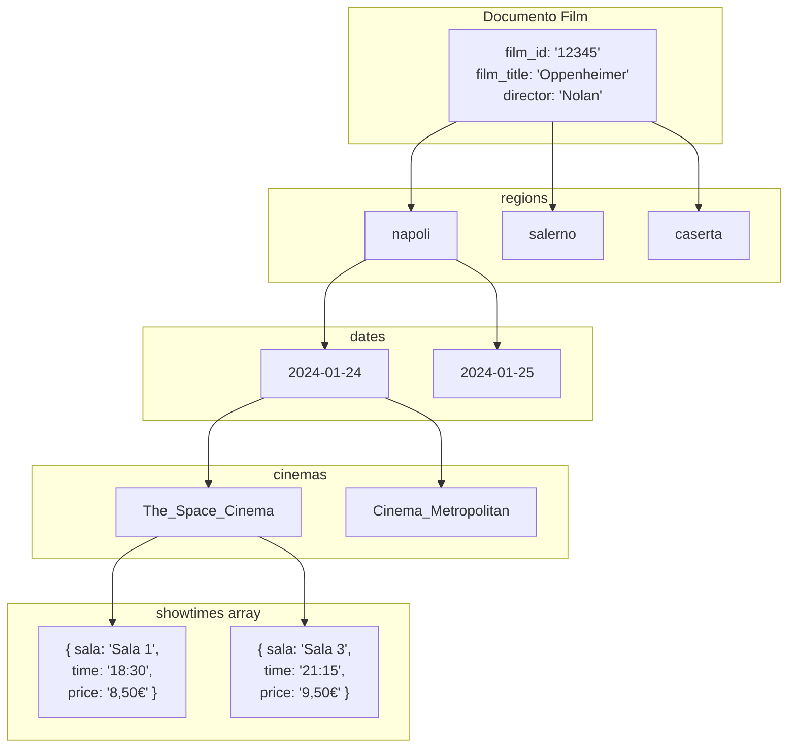

# Capitolo 4: Acquisizione Dati Cinematografici e Gestione Showtimes

Questo capitolo illustra il flusso tecnico per il recupero, l'elaborazione e la memorizzazione degli orari di programmazione cinematografica. Il sistema è progettato per operare in tempo reale, garantendo che le informazioni fornite agli utenti siano sempre allineate con le proiezioni effettive nelle sale.

## 4.1 Panoramica del Flusso di Acquisizione

L'acquisizione dei dati avviene attraverso un processo di **Web Scraping** automatizzato che interroga il portale *ComingSoon.it*, una delle fonti più autorevoli per la programmazione cinematografica italiana. Il modulo responsabile è `cinema_pipeline.py`.

Il flusso di lavoro si articola nelle seguenti fasi sequenziali:

1.  **Inizializzazione e Configurazione**:
    *   Il sistema seleziona le province target (nello specifico, le province della Campania: Napoli, Salerno, Caserta, Avellino, Benevento).
    *   Vengono definiti i parametri di connessione al database MongoDB e le configurazioni per le richieste HTTP (User-Agent, timeout).

2.  **Scraping per Provincia**:
    *   Per ogni provincia, il sistema effettua una richiesta alla pagina dedicata (es. `/cinema/napoli/`).
    *   Utilizzando la libreria **BeautifulSoup**, viene effettuato il parsing dell'HTML per estrarre la lista dei film attualmente in programmazione.

3.  **Estrazione Dettagli Film e Orari**:
    *   Per ogni film identificato, viene eseguita una seconda richiesta specifica per recuperare i dettagli, come il titolo originale e il regista.
    *   Contestualmente, vengono estratti gli orari di proiezione, le sale, i prezzi e gli indirizzi dei cinema che proiettano quel film nella provincia specifica.

4.  **Normalizzazione e Pulizia Dati**:
    *   I dati grezzi vengono puliti (rimozione spazi extra, normalizzazione formati orari).
    *   Viene applicata una logica di deduplicazione per gestire eventuali ridondanze.

5.  **Persistenza su MongoDB**:
    *   I dati strutturati vengono salvati nella collezione `showtimes` utilizzando operazioni di *upsert* (aggiornamento se esistente, inserimento se nuovo) per garantire l'idempotenza del processo.

---

## 4.2 Struttura della Collezione `showtimes`

La scelta architetturale per lo schema di MongoDB privilegia l'aggregazione dei dati attorno all'entità **Film**. Invece di avere documenti separati per ogni proiezione, tutte le informazioni relative alla programmazione di un film (in diverse regioni, date e cinema) sono condensate in un unico documento.

### 4.2.1 Vantaggi dello Schema

*   **Lettura Ottimizzata**: Recuperare tutte le proiezioni di un film richiede un'unica query.
*   **Gerarchia Logica**: La struttura riflette la natura gerarchica dei dati: `Film -> Regione -> Data -> Cinema -> Orari`.
*   **Aggiornamenti Atomici**: È possibile aggiornare gli orari di uno specifico cinema senza dover riscrivere l'intero documento del film.

### 4.2.2 Esempio di Documento JSON

Di seguito è riportato un esempio rappresentativo di come un documento viene memorizzato nella collezione `showtimes`.

```json
{
  "_id": ObjectId("..."),
  "film_id": "12345",
  "film_title": "Oppenheimer",
  "film_original_title": "Oppenheimer",
  "director": "Christopher Nolan",
  "last_updated": "2024-01-24T15:30:00+01:00",
  "regions": {
    "napoli": {
      "dates": {
        "2024-01-24": {
          "cinemas": {
            "The_Space_Cinema": {
              "cinema_name": "The Space Cinema",
              "cinema_url": "https://www.comingsoon.it/cinema/...",
              "showtimes": [
                {
                  "sala": "Sala 1",
                  "time": "18:30",
                  "price": "8,50€"
                },
                {
                  "sala": "Sala 3",
                  "time": "21:15",
                  "price": "9,50€"
                }
              ]
            },
            "Cinema_Metropolitan": {
              "cinema_name": "Cinema Metropolitan",
              "cinema_url": "...",
              "showtimes": [
                {
                  "sala": "Sala Blu",
                  "time": "20:00",
                  "price": "7,00€"
                }
              ]
            }
          }
        }
      }
    },
    "salerno": {
        "dates": {
            "2024-01-24": {
                "cinemas": { ... }
            }
        }
    }
  }
}
```

## 4.3 Logica di Aggiornamento e Mantenimento

Il sistema implementa una politica di mantenimento automatico dei dati per evitare che la collezione cresca indefinitamente con informazioni obsolete.

### Codice di Salvataggio e Pulizia

Il seguente snippet (tratto da `cinema_pipeline.py`) mostra come i dati vengono salvati e come vengono rimossi gli orari più vecchi di 30 giorni.

```python
def save_to_mongodb(data: List[Dict]):
    # ... connessione al db ...
    
    cutoff_date = (datetime.now(italy_tz) - timedelta(days=30)).strftime("%Y-%m-%d")
    
    for record in data:
        # Costruzione del path gerarchico per l'update
        # regions.<region>.dates.<date>.cinemas.<cinema>
        cinema_path = f"regions.{region_slug}.dates.{today_str}.cinemas.{cinema_key}"
        
        update_set = {
            "film_id": film_id,
            "film_title": record["film_title"],
            # ... altri campi metadata ...
            f"{cinema_path}.cinema_name": cinema_name,
            f"{cinema_path}.showtimes": showtimes_list
        }
        
        # Operazione atomica di UPSERT
        collection.update_one(
            {"film_id": film_id},v
            {"$set": update_set},
            upsert=True
        )

    # Pulizia automatica date obsolete
    # Rimuove le chiavi "dates.<data>" precedenti alla cutoff_date
    for doc in collection.find({}):
        unset_fields = {}
        for region in doc.get("regions", {}):
            for date_str in doc["regions"][region]["dates"]:
                if date_str < cutoff_date:
                    unset_fields[f"regions.{region}.dates.{date_str}"] = ""
        
        if unset_fields:
            collection.update_one({"_id": doc["_id"]}, {"$unset": unset_fields})
```

Questa metodologia garantisce che il database rimanga performante e che lo spazio di archiviazione sia utilizzato in modo efficiente, mantenendo solo lo storico recente necessario per eventuali analisi o funzionalità di "rewind" limitato.

---

### Struttura Gerarchica Dati

La collezione `showtimes` utilizza un documento nidificato che riflette la gerarchia naturale:



**Vantaggi della struttura**:
- **Query O(1)**: Accesso diretto via path `regions.napoli.dates.2024-01-24.cinemas`
- **Update Atomici**: `$set` su path specifico senza toccare il resto del documento
- **Cleanup Efficiente**: `$unset` su date obsolete senza riscrivere tutto

---

### Tabella Riepilogativa Campi

| Campo | Tipo | Descrizione |
|:------|:-----|:------------|
| `film_id` | string | ID univoco ComingSoon |
| `film_title` | string | Titolo italiano |
| `film_original_title` | string | Titolo originale |
| `director` | string | Nome regista |
| `last_updated` | ISO 8601 | Timestamp ultimo aggiornamento |
| `regions.<slug>.dates.<data>.cinemas.<key>.showtimes` | array | Lista orari con sala/prezzo |
