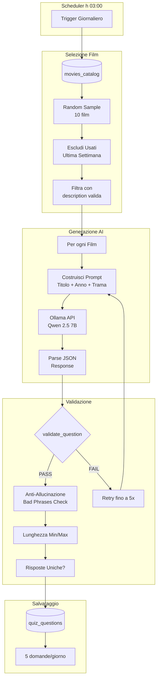

# Capitolo 7: Sistema di Quiz Generativo con AI

Il sistema CineMatch integra un modulo avanzato per la *Gamification* che stimola l'engagement degli utenti attraverso quiz giornalieri sul cinema. A differenza dei tradizionali sistemi statici, i quiz vengono generati dinamicamente ogni giorno utilizzando modelli linguistici locali (LLM), garantendo varietà e pertinenza rispetto al catalogo film.

## 7.1 Architettura del Generatore

Il nucleo del sistema risiede nel modulo `quiz_generator.py`, che orchestra l'interazione tra:
1.  **MongoDB**: Per il recupero dei metadati dei film (trama, cast, anno) e il salvataggio delle domande.
2.  **Ollama**: Server di inferenza per LLM locale, ospitato in container Docker.
3.  **FastAPI**: Per l'esposizione dei quiz al frontend e la raccolta dei risultati.
4.  **Scheduler**: Per l'automazione del processo di generazione notturna (h 03:00).

### Modello AI Utilizzato
Il sistema adotta **Qwen 2.5 7B** (versione quantizzata `q5_K_M`), scelto per le sue eccellenti capacità di ragionamento e comprensione della lingua italiana, mantenendo un footprint di risorse gestibile per un'esecuzione locale.

---

## 7.2 Flusso di Generazione (Step-by-Step)

Il processo di generazione (`run_daily_quiz_generation`) segue una pipeline rigorosa per assicurare la qualità dei contenuti:

1.  **Selezione Film Candidati**:
    *   Vengono estratti casualmente film dal catalogo (`movies_catalog`).
    *   Il sistema esclude i film utilizzati nell'ultima settimana (rolling window deduplication) per evitare ripetizioni ravvicinate.
    *   Vengono selezionati solo film che possiedono una trama (`description`) valida.

2.  **Prompt Engineering**:
    *   Per ogni film, viene costruito un prompt specifico che inietta il contesto (Titolo, Anno, Trama) nel modello.
    *   Il prompt impone regole stringenti ("Regole Critiche"):
        *   Output strettamente in formato JSON.
        *   4 risposte plausibili ma distinte.
        *   Nessun riferimento al titolo nella domanda (es. vietato chiedere "Come si chiama questo film?").
        *   Spiegazione dettagliata della risposta corretta.

3.  **Validazione Euristica (`validate_question`)**:
    Prima di essere salvata, ogni domanda generata passa attraverso un filtro di qualità *Zero Tolerance*:
    *   **Anti-Allucinazione**: Rilevamento di parole chiave sospette o template generici (es. "risposta 1", "testo della domanda").
    *   **Controllo Formale**: Lunghezza minima/massima di domanda e risposte.
    *   **Controllo Grammaticale**: Correzione automatica o scarto di errori comuni (es. "qual'è" vs "qual è").
    *   **Unicità**: Verifica che le 4 risposte siano distinte tra loro.

4.  **Retry Logic**:
    *   Se una domanda fallisce la validazione, il sistema ritenta la generazione fino a 5 volte per quel film, eventualmente cambiando parametri o rigenerando.

---

## 7.3 Schema Dati

Le domande validate vengono persistite nella collezione `quiz_questions`.

### Esempio di Documento Quiz

```json
{
  "_id": ObjectId("..."),
  "movie_id": "tt1375666",
  "movie_title": "Inception",
  "movie_year": 2010,
  "question": "Qual è l'oggetto personale che Cobb usa come totem per distinguere la realtà dal sogno?",
  "answers": [
    { "id": "a", "text": "Una trottola di metallo", "isCorrect": true },
    { "id": "b", "text": "Un dado truccato", "isCorrect": false },
    { "id": "c", "text": "Un pezzo degli scacchi", "isCorrect": false },
    { "id": "d", "text": "Una moneta d'oro", "isCorrect": false }
  ],
  "explanation": "Cobb usa una piccola trottola che apparteneva a sua moglie Mal; se continua a girare all'infinito è in un sogno, se cade è nella realtà.",
  "category": "plot",
  "difficulty": "medium",
  "quiz_date": "2024-01-24",
  "created_at": "2024-01-24T03:00:00+01:00"
}
```

---

## 7.4 Integrazione API

Il frontend interagisce con il sistema quiz tramite due endpoint principali definiti in `main.py`:

*   **GET `/quiz/questions`**: 
    *   Restituisce le 5 domande giornaliere.
    *   Implementa una logica di fallback: se per errore non sono state generate domande per la data odierna (`today`), recupera automaticamente il primo batch disponibile dal futuro o dallo storico recente, garantendo continuità di servizio.
    
*   **POST `/quiz/submit`**:
    *   Riceve il punteggio dell'utente (risposte corrette/errate).
    *   Aggiorna atomicanente il profilo utente (`users.quiz`), incrementando i contatori `correct_count`, `wrong_count` e `total_attempts`.
    *   Impedisce invii multipli ("cheating") verificando se l'utente ha già sottomesso un risultato per la data corrente (`last_date`).

## 7.5 Snippet di Codice Significativo

Di seguito, la logica di validazione che garantisce la qualità delle domande generate dall'AI:

```python
def validate_question(q: Dict) -> Tuple[bool, str]:
    # 1. Template generici (ZERO TOLERANCE)
    bad_phrases = ["domanda sul film", "risposta 1", "qual è il titolo"]
    
    # 2. Lunghezza minima
    if len(q["question"]) < 30:
        return False, "Domanda troppo corta"
    
    # 3. Risposte uniche
    answer_texts = [a["text"] for a in q["answers"]]
    if len(set(answer_texts)) < 4:
        return False, "Risposte duplicate"
    
    # 4. Spiegazione non ripetitiva
    if q["question"][:50].lower() in q["explanation"].lower():
        return False, "Spiegazione ripete la domanda"
        
    return True, "OK"
```

---

## 7.6 Diagrammi di Flusso

### Pipeline di Generazione Quiz (Notturna)




