# Documentazione Kafka Producer e Spark Stats Processor

## Indice
1. [kafka_producer.py - Funzioni](#kafka_producerpy---funzioni)
2. [spark_stats_processor.py - Funzioni](#spark_stats_processorpy---funzioni)
3. [Schema Eventi Kafka](#schema-eventi-kafka)
4. [Funzionamento Spark: Creazione user_stats e user_affinities](#funzionamento-spark-creazione-user_stats-e-user_affinities)
5. [Global Stats: Bootstrap e Streaming](#global-stats-bootstrap-e-streaming)

---

## kafka_producer.py - Funzioni

### Classe `MovieEventProducer`

| Funzione | Descrizione |
|----------|-------------|
| `__init__()` | Inizializza il producer con configurazione Kafka. Legge `KAFKA_BOOTSTRAP_SERVERS` da variabili d'ambiente (default: `localhost:9092`). Imposta `_producer = None` e `_is_connected = False`. |
| `_get_producer()` | **Lazy initialization** del producer Kafka. Configura: serializzazione JSON (`value_serializer`), chiave come stringa UTF-8, `acks='all'` per delivery garantita, 3 retry con backoff 500ms, timeout 10s. Restituisce `None` se Kafka non è raggiungibile (graceful degradation). |
| `send_movie_event(event_type, user_id, movie_data)` | Pubblica un singolo evento su topic `user-movie-events`. Costruisce payload con: `event_type`, `user_id`, oggetto `movie` (name, year, rating, imdb_id, genres, duration, director, actors, date, old_rating, new_rating), `timestamp` (fuso orario Europe/Rome). Usa `user_id` come chiave di partizionamento. Attende conferma con timeout 5s. Restituisce `True`/`False`. |
| `send_batch_event(event_type, user_id, movies)` | Itera sulla lista `movies` e pubblica un evento per ciascuno nel **formato identico** a `send_movie_event()`. Usato per BULK_IMPORT o RECALCULATE. Esegue `flush()` finale per garantire consegna. Restituisce `True` se almeno un evento è stato inviato. |
| `flush()` | Forza l'invio immediato di tutti i messaggi bufferizzati al broker Kafka. |
| `close()` | Chiude il producer, rilascia risorse e resetta lo stato di connessione. |

### Funzione Globale

| Funzione | Descrizione |
|----------|-------------|
| `get_kafka_producer()` | Pattern **Singleton**: restituisce sempre la stessa istanza di `MovieEventProducer`. Evita connessioni multiple al broker. |

### Configurazione Producer Kafka

```python
KafkaProducer(
    bootstrap_servers=["localhost:9092"],
    value_serializer=lambda v: json.dumps(v, default=str).encode('utf-8'),
    key_serializer=lambda k: k.encode('utf-8') if k else None,
    acks='all',           # Attende conferma da tutti i replica
    retries=3,            # Tentativi in caso di errore
    retry_backoff_ms=500, # Attesa tra retry
    request_timeout_ms=10000,
    max_block_ms=10000    # Non bloccare troppo se Kafka è down
)
```

---

## spark_stats_processor.py - Funzioni

### Funzioni Helper

| Funzione | Descrizione |
|----------|-------------|
| `normalize_title(text)` | Normalizza titolo: rimuove accenti via NFD decomposition, mappa caratteri speciali (ø→o, æ→ae, ß→ss, ñ→n, etc.), rimuove punteggiatura, converte in lowercase. Usato per matching tra titoli italiani/originali. |
| `clean_key(name)` | *(Interna a `process_partition_incremental`)* Pulisce nomi per usarli come chiavi MongoDB: sostituisce `.`, `$`, spazi con `_`. Restituisce "Unknown" se vuoto. |
| `merge_inc_fields(aggregated, new_fields)` | *(Interna)* Somma i valori di `new_fields` in `aggregated` per chiavi uguali. Usato per accumulare delta in memoria. |

### Funzioni Spark Session

| Funzione | Descrizione |
|----------|-------------|
| `create_spark_session()` | Crea `SparkSession` con nome `CineMatch-StatsProcessor`. Configura pacchetti Maven: `spark-sql-kafka-0-10_2.12:3.4.1` e `mongo-spark-connector_2.12:10.2.0`. Imposta URI MongoDB per read/write su `cinematch_db`. Checkpoint in `/tmp/spark-checkpoints`. |

### Funzioni di Elaborazione Partizione

| Funzione | Descrizione |
|----------|-------------|
| `process_partition_incremental(iterator)` | **(V6 - ATTUALE)** Elabora partizione in modo **incrementale O(1)**. Per ogni evento: (1) lookup batch catalogo, (2) accumula delta in dizionari `user_stats_inc` e `user_affinities_inc`, (3) esegue 2 `bulk_write()` atomiche. Gestisce ADD, DELETE, UPDATE_RATING. Scrive su `user_stats` e `user_affinities`. |
| `process_partition_legacy(iterator)` | **(V3 - LEGACY)** Rilegge **tutti i film** dell'utente da `movies` collection, ricalcola stats complete con `compute_user_stats()`, scrive `$set` completo. Complessità O(N). Usato solo per migrazione/bootstrap. |
| `process_partition(iterator)` | Alias/wrapper che chiama `process_partition_incremental()`. Mantiene retrocompatibilità. |

### Funzioni di Batch Processing

| Funzione | Descrizione |
|----------|-------------|
| `process_batch(batch_df, batch_id)` | Callback per `foreachBatch` dello stream user_stats. Raggruppa DataFrame per `user_id`, colleziona eventi con `collect_list(struct(...))` includendo: event_type, name, year, rating, date, old_rating, new_rating. Chiama `foreachPartition(process_partition)` per elaborazione parallela. |

### Funzioni Global Stats

| Funzione | Descrizione |
|----------|-------------|
| `bootstrap_global_stats()` | **Inizializzazione una tantum** all'avvio. Legge tutti i film degli ultimi 30 giorni da `movies` collection. Calcola `movie_counts` (Counter), `genre_counts`, `top_movies` (Top 10), `trending_genres`. Salva `poster_cache` per evitare lookup ripetuti. Scrive su `global_stats` con `source: "bootstrap"`. |
| `write_global_trends_to_mongo(batch_df, batch_id)` | Callback streaming per global trends. Legge stato esistente da `global_stats`. Per ogni riga: se DELETE → decrementa conteggio, altrimenti incrementa. Aggiorna `poster_cache`. Ricalcola Top 10 e percentuali generi. Scrive con `source: "streaming_incremental"`. |
| `start_global_trends_stream(spark, parsed_stream)` | Configura Structured Streaming per trend globali. Aggiunge colonna `event_ts` da timestamp. Applica **watermark 1 ora** per gestire late data. Raggruppa per `(movie_name, event_type)`. Trigger ogni **2 minuti**. Output mode: `update`. Checkpoint: `/tmp/spark-checkpoints/today-trends`. |

### Funzione Calcolo Statistiche Complete

| Funzione | Descrizione |
|----------|-------------|
| `compute_user_stats(movies, catalog_collection, prefetched_map)` | Calcola statistiche **complete** da lista film. Restituisce dizionario con: `total_watched`, `avg_rating`, `rating_chart_data` (distribuzione 1-5), `top_rated_movies` (rating ≥4), `recent_movies` (ultimi 10), `year_data` (mensile per anno), `available_years`, `top_years`, `genre_data` (con colori e percentuali), `favorite_genre`, `watch_time_hours`, `avg_duration`, `best_rated_directors` (per soglie 1,2,3,5), `most_watched_directors`, `best_rated_actors`, `most_watched_actors`. Usato da versione legacy. |

### Entry Point

| Funzione | Descrizione |
|----------|-------------|
| `main()` | Entry point applicazione. (1) Chiama `bootstrap_global_stats()`, (2) crea SparkSession, (3) legge stream Kafka con `startingOffsets: latest`, (4) parse JSON con `event_schema`, (5) avvia stream `user_stats_stream` (trigger 5s), (6) avvia `global_trends_stream` (trigger 2min), (7) attende terminazione con `awaitAnyTermination()`. |

---

## Schema Eventi Kafka

### Struttura Evento JSON

```json
{
  "event_type": "ADD | UPDATE | DELETE | UPDATE_RATING | BULK_IMPORT | RECALCULATE",
  "user_id": "user123",
  "movie": {
    "name": "Inception",
    "year": 2010,
    "rating": 5,
    "imdb_id": "tt1375666",
    "genres": ["Sci-Fi", "Action", "Thriller"],
    "duration": 148,
    "director": "Christopher Nolan",
    "actors": "Leonardo DiCaprio, Joseph Gordon-Levitt, Ellen Page",
    "date": "2025-01-20",
    "old_rating": 4,
    "new_rating": 5
  },
  "timestamp": "2025-01-21T00:45:00+01:00"
}
```

### Schema Spark (PySpark StructType)

```python
movie_schema = StructType([
    StructField("name", StringType(), True),
    StructField("year", IntegerType(), True),
    StructField("rating", IntegerType(), True),
    StructField("imdb_id", StringType(), True),
    StructField("genres", ArrayType(StringType()), True),
    StructField("duration", IntegerType(), True),
    StructField("director", StringType(), True),
    StructField("actors", StringType(), True),
    StructField("date", StringType(), True),
    StructField("old_rating", IntegerType(), True),
    StructField("new_rating", IntegerType(), True)
])

event_schema = StructType([
    StructField("event_type", StringType(), True),
    StructField("user_id", StringType(), True),
    StructField("movie", movie_schema, True),
    StructField("timestamp", StringType(), True)
])
```

### Tipi di Evento

| Event Type | Quando viene generato | Effetto su Stats |
|------------|----------------------|------------------|
| `ADD` | Utente aggiunge film alla lista | Incrementa tutti i contatori |
| `DELETE` | Utente rimuove film dalla lista | Decrementa tutti i contatori |
| `UPDATE` | Utente modifica dettagli film (non rating) | Ricalcola se necessario |
| `UPDATE_RATING` | Utente cambia voto (es. 4→5) | Solo `sum_ratings` e `rating_distribution` |
| `BULK_IMPORT` | Import massivo da CSV/file | Come ADD, per ogni film |
| `RECALCULATE` | Trigger ricalcolo forzato | Forza aggiornamento stats |

---

## Funzionamento Spark: Creazione user_stats e user_affinities

### Architettura Generale

```
┌─────────────────┐      ┌─────────────────┐      ┌─────────────────┐
│  FastAPI        │      │  Kafka Topic    │      │  Spark          │
│  Backend        │─────▶│  user-movie-    │─────▶│  Streaming      │
│                 │      │  events         │      │                 │
└─────────────────┘      └─────────────────┘      └────────┬────────┘
                                                          │
                                                          ▼
                                               ┌─────────────────────┐
                                               │  MongoDB            │
                                               │  - user_stats       │
                                               │  - user_affinities  │
                                               │  - global_stats     │
                                               └─────────────────────┘
```

### Diagramma di Sequenza: Aggiunta Film

Il diagramma seguente mostra il flusso **end-to-end** quando un utente aggiunge un film:

#### 📊 Schema Visivo del Flusso


> [!NOTE]
> **Timing del sistema:**
> - **User Stats Stream**: trigger ogni **5 secondi**
> - **Global Trends Stream**: trigger ogni **2 minuti** (stream separato)
> - Spark esegue **batch lookup** su `movies_catalog` per arricchimento dati

#### Diagramma di Sequenza

```
┌────────┐   ┌──────────┐   ┌─────────────┐   ┌───────┐   ┌───────┐   ┌─────────┐
│ Utente │   │ Frontend │   │ Backend API │   │ Kafka │   │ Spark │   │ MongoDB │
└────┬───┘   └────┬─────┘   └──────┬──────┘   └───┬───┘   └───┬───┘   └────┬────┘
     │            │                │               │           │            │
     │  Clicca "Aggiungi Film"     │               │           │            │
     │───────────>│                │               │           │            │
     │            │                │               │           │            │
     │            │  POST /movies  │               │           │            │
     │            │───────────────>│               │           │            │
     │            │                │                           │            │
     │            │                │──────────────────────────────────────>│
     │            │                │  ① insert_one() in 'movies'           │
     │            │                │                           │            │
     │            │                │──────────────>│           │            │
     │            │                │  ② send_movie_event('ADD')│            │
     │            │                │               │           │            │
     │            │ {"status":"ok"}│               │           │            │
     │            │<───────────────│               │           │            │
     │   Film     │                │               │           │            │
     │  aggiunto! │                │               │           │            │
     │<───────────│                │               │           │            │
     │            │                │               │           │            │
     │  ┌─────────────────────────────────────────────────────────────────┐│
     │  │ Dashboard mostra "syncing..." mentre attende elaborazione Spark ││
     │  └─────────────────────────────────────────────────────────────────┘│
     │            │                │               │           │            │
     │            │                │               │ ┌─────────────────────┐│
     │            │                │               │ │ ③ SPARK CONSUMA     ││
     │            │                │               │ │  trigger: 5 secondi ││
     │            │                │               │ └─────────────────────┘│
     │            │                │               │           │            │
     │            │                │               │  Batch di │            │
     │            │                │               │  eventi   │            │
     │            │                │               │──────────>│            │
     │            │                │               │           │            │
     │            │                │               │           │ ④ Batch    │
     │            │                │               │           │   Lookup   │
     │            │                │               │           │   catalogo │
     │            │                │               │           │ ──────────>│
     │            │                │               │           │ (director, │
     │            │                │               │           │  actors,   │
     │            │                │               │           │  genres,   │
     │            │                │               │           │  duration) │
     │            │                │               │           │<──────────│
     │            │                │               │           │            │
     │            │                │               │           │ ⑤ $inc su  │
     │            │                │               │           │ user_stats │
     │            │                │               │           │ ──────────>│
     │            │                │               │           │            │
     │            │                │               │           │ ⑥ $inc su  │
     │            │                │               │           │ user_      │
     │            │                │               │           │ affinities │
     │            │                │               │           │ ──────────>│
     │            │                │               │           │            │
     │            │                │               │ ┌─────────────────────┐│
     │            │                │               │ │ ⑦ GLOBAL TRENDS     ││
     │            │                │               │ │  (STREAM SEPARATO)  ││
     │            │                │               │ │  trigger: 2 minuti  ││
     │            │                │               │ └─────────────────────┘│
     │            │                │               │           │ Update     │
     │            │                │               │           │ global_    │
     │            │                │               │           │ stats      │
     │            │                │               │           │ ──────────>│
     │            │                │               │           │            │
     │            │                │               │           │            │
     │  Refresh Dashboard          │               │           │            │
     │───────────>│                │               │           │            │
     │            │ GET /user-stats│               │           │            │
     │            │───────────────>│               │           │            │
     │            │                │ ⑧ Query user_stats          │          │
     │            │                │   + user_affinities         │          │
     │            │                │───────────────────────────────────────>│
     │            │                │<───────────────────────────────────────│
     │            │                │               │           │            │
     │            │ Stats complete │               │           │            │
     │            │ aggiornate     │               │           │            │
     │            │<───────────────│               │           │            │
     │ Dashboard  │                │               │           │            │
     │ aggiornata │                │               │           │            │
     │<───────────│                │               │           │            │
```

#### Legenda Step-by-Step

| Step | Componente | Azione | Latenza |
|------|------------|--------|---------|
| ① | Backend → MongoDB | `insert_one()` in collezione `movies` | ~10-50ms |
| ② | Backend → Kafka | `send_movie_event('ADD', user_id, movie_data)` | ~5-20ms |
| ③ | Kafka → Spark | Spark consuma batch (trigger **5 secondi**) | 0-5s |
| ④ | Spark → MongoDB | Batch lookup `movies_catalog` per arricchimento | ~20-100ms |
| ⑤ | Spark → MongoDB | `$inc` atomico su `user_stats` | ~10-30ms |
| ⑥ | Spark → MongoDB | `$inc` atomico su `user_affinities` | ~10-30ms |
| ⑦ | Spark → MongoDB | Update `global_stats` (stream separato, **2 minuti**) | - |
| ⑧ | API → MongoDB | Query diretta `user_stats` + `user_affinities` | ~20-50ms |

> [!NOTE]
> **Timing del Sistema:**
> - **User Stats Stream**: trigger ogni **5 secondi**
> - **Global Trends Stream**: trigger ogni **2 minuti** (stream separato)
> - **Latenza totale visibilità frontend**: ~10-30 secondi

### Flusso di Elaborazione Dettagliato

> [!NOTE]
> Il diagramma seguente mostra il flusso **completo** dall'azione utente all'aggiornamento delle statistiche, con i timing reali del sistema.

```mermaid
sequenceDiagram
    autonumber
    participant U as 👤 Utente
    participant FE as 🖥️ Frontend
    participant API as ⚙️ Backend API
    participant K as 📨 Kafka
    participant S as ⚡ Spark
    participant M as 🗃️ MongoDB

    %% === FASE 1: Azione Utente ===
    rect rgb(240, 248, 255)
        Note over U,API: FASE 1 - Azione Utente (sincrona, ~100ms)
        U->>FE: Clicca "Aggiungi Film"
        FE->>API: POST /movies
        API->>M: insert_one() in 'movies'
        API->>K: send_movie_event('ADD')
        API-->>FE: {"status": "ok"}
        FE-->>U: ✓ Film aggiunto!
    end

    %% === FASE 2: Dashboard mostra syncing ===
    rect rgb(255, 250, 205)
        Note over FE: Dashboard mostra "syncing..."
        FE->>FE: Polling /user-stats o refresh
    end

    %% === FASE 3: Spark Processing ===
    rect rgb(230, 255, 230)
        Note over K,M: FASE 2 - Elaborazione Asincrona (ogni 5 secondi)
        
        Note right of S: ⏱️ Trigger: ogni 5 secondi
        K->>S: Batch di eventi
        S->>M: Batch lookup movies_catalog
        M-->>S: director, actors, genres, duration
        
        S->>S: Calcola delta incrementali
        
        par Scritture parallele
            S->>M: $inc su user_stats
            S->>M: $inc su user_affinities
        end
    end

    %% === FASE 4: Global Trends (separato) ===
    rect rgb(255, 240, 245)
        Note over S,M: FASE 3 - Global Trends (ogni 2 minuti)
        Note right of S: ⏱️ Trigger: ogni 2 minuti
        S->>M: Update global_stats (top_movies, trending_genres)
    end

    %% === FASE 5: Lettura Statistiche ===
    rect rgb(240, 248, 255)
        Note over U,M: FASE 4 - Lettura Statistiche (~10-30s dopo)
        FE->>API: GET /user-stats
        API->>M: Query user_stats + user_affinities
        M-->>API: Dati aggiornati
        API-->>FE: Stats complete aggiornate
        FE-->>U: 📊 Dashboard aggiornata!
    end
```



#### Legenda Temporale

| Fase | Descrizione | Latenza |
|------|-------------|---------|
| **1** | Azione utente → Risposta API | ~100-200ms (sincrona) |
| **2** | Kafka → Spark consume | < 1 secondo |
| **3** | Spark batch processing (user_stats) | Ogni 5 secondi |
| **4** | Spark batch processing (global_stats) | Ogni 2 minuti |
| **5** | Visibilità frontend | ~10-30 secondi totali |

> [!IMPORTANT]
> La risposta `{"status": "ok"}` viene restituita **immediatamente** dopo l'inserimento in MongoDB e la pubblicazione su Kafka. L'utente non deve attendere l'elaborazione Spark.

---

1. **Evento Generato (Backend)**
   - Utente esegue azione (add/delete/update film)
   - `get_kafka_producer().send_movie_event()` pubblica su Kafka
   - Partizionamento per `user_id` garantisce ordine per utente

2. **Spark Consuma da Kafka**
   ```python
   kafka_stream = spark.readStream \
       .format("kafka") \
       .option("subscribe", "user-movie-events") \
       .option("startingOffsets", "latest")  # Solo nuovi eventi
       .option("failOnDataLoss", "false")    # Continua anche se dati persi
       .load()
   ```

3. **Parsing JSON**
   ```python
   parsed_stream = kafka_stream \
       .selectExpr("CAST(value AS STRING) as json_value") \
       .select(from_json(col("json_value"), event_schema).alias("data")) \
       .select("data.*")
   ```

4. **Micro-Batch Processing (ogni 5 secondi)**
   ```python
   user_events_df = batch_df.groupBy("user_id").agg(
       collect_list(struct(
           col("event_type"),
           col("movie.name").alias("name"),
           col("movie.rating").alias("rating"),
           col("movie.date").alias("date"),
           col("movie.old_rating").alias("old_rating"),
           col("movie.new_rating").alias("new_rating")
       )).alias("events")
   )
   user_events_df.foreachPartition(process_partition)
   ```

---

### Logica user_stats (Collezione MongoDB)

#### Schema Documento

```javascript
{
  "_id": ObjectId("..."),
  "user_id": "user123",
  
  // Metriche globali (incrementali)
  "total_watched": 42,           // Totale film visti
  "sum_ratings": 168,            // Somma di tutti i voti (per calcolare media)
  "watch_time_minutes": 5460,    // Tempo totale di visione
  
  // Distribuzione voti (1-5 stelle)
  "rating_distribution": {
    "1": 2, "2": 5, "3": 12, "4": 15, "5": 8
  },
  
  // Film per mese/anno (struttura nidificata)
  "monthly_counts": {
    "2024": { "01": 5, "02": 8, "03": 3, "12": 10 },
    "2025": { "01": 10 }
  },
  
  // Metadati
  "updated_at": "2025-01-21T00:45:00+01:00",
  "stats_version": "6.0_flat_affinities"
}
```

#### Logica Incrementale O(1)

**Principio**: Non rileggiamo mai tutti i film dell'utente. Ogni evento produce solo un `$inc`.

| Event Type | Campi $inc |
|------------|------------|
| **ADD** | `total_watched: +1`, `sum_ratings: +rating`, `watch_time_minutes: +duration`, `rating_distribution.{rating}: +1`, `monthly_counts.{year}.{month}: +1` |
| **DELETE** | Stessi campi con delta `-1` |
| **UPDATE_RATING** | Solo `sum_ratings: (new-old)`, `rating_distribution.{old}: -1`, `rating_distribution.{new}: +1` |

**Codice di aggregazione in memoria:**

```python
# Inizializza dizionario per utente
if user_id not in user_stats_inc:
    user_stats_inc[user_id] = {}

# Per evento ADD/DELETE
delta = -1 if "DELETE" in event_type else 1
stats_inc = {
    "total_watched": delta,
    "sum_ratings": rating * delta,
    "watch_time_minutes": duration * delta,
    f"rating_distribution.{rating}": delta,
    f"monthly_counts.{year}.{month}": delta
}
merge_inc_fields(user_stats_inc[user_id], stats_inc)

# Per UPDATE_RATING
if "UPDATE_RATING" in event_type:
    stats_inc = {
        f"rating_distribution.{old_rating}": -1,
        f"rating_distribution.{new_rating}": +1,
        "sum_ratings": new_rating - old_rating
    }
    merge_inc_fields(user_stats_inc[user_id], stats_inc)
```

**Bulk Write atomico:**

```python
bulk_ops = []
for user_id, aggregated_inc in user_stats_inc.items():
    bulk_ops.append(UpdateOne(
        {"user_id": user_id},
        {
            "$inc": aggregated_inc,
            "$set": {
                "updated_at": now_timestamp,
                "stats_version": "6.0_flat_affinities"
            }
        },
        upsert=True
    ))
db.user_stats.bulk_write(bulk_ops, ordered=False)
```

---

### Logica user_affinities (Collezione MongoDB)

#### Schema Documento (Struttura Piatta)

```javascript
// UN documento per ogni combinazione utente-tipo-nome
{
  "_id": "user123_director_Christopher_Nolan",  // ID composto
  "user_id": "user123",
  "type": "director",           // "director" | "actor" | "genre"
  "name": "Christopher Nolan",  // Nome originale
  "name_key": "Christopher_Nolan",  // Nome normalizzato (chiave)
  "count": 5,                   // Numero di film visti
  "sum_voti": 23,               // Somma dei voti (per media)
  "updated_at": "2025-01-21T00:45:00+01:00"
}
```

#### Generazione ID

```python
def clean_key(name):
    return name.strip().replace(".", "_").replace("$", "_").replace(" ", "_")

# Esempi:
# "Christopher Nolan" → "Christopher_Nolan"
# "J.J. Abrams" → "J_J__Abrams"
# "Robert Downey Jr." → "Robert_Downey_Jr_"

affinity_id = f"{user_id}_{type}_{clean_key(name)}"
# "user123_director_Christopher_Nolan"
```

#### Lookup Catalogo per Enrichment

Prima di processare gli eventi, Spark fa un **batch lookup** sul catalogo:

```python
# Raccogli tutti i titoli unici nel batch
all_titles = set()
for row in all_rows:
    for event in row.events:
        all_titles.add(event.name)

# Query batch (O(batch_size), non O(N_user_movies))
catalog_docs = db.movies_catalog.find({
    "$or": [
        {"title": {"$in": list(all_titles)}},
        {"original_title": {"$in": list(all_titles)}},
        {"normalized_title": {"$in": normalized_titles}},
        {"normalized_original_title": {"$in": normalized_titles}}
    ]
})

# Costruisci mappa title → catalog_info
for doc in catalog_docs:
    catalog_map[doc.get('title')] = doc
    catalog_map[doc.get('original_title')] = doc
    # ... anche normalized variants
```

#### Logica Incrementale per Affinities

```python
# Per ogni evento
catalog_info = catalog_map.get(movie_name) or {}
director = catalog_info.get("director", "")
actors_str = catalog_info.get("actors", "")
genres = catalog_info.get("genres", [])

delta = -1 if "DELETE" in event_type else 1
rating_delta = rating * delta

# DIRECTORS (max 2 per film)
directors_list = [d.strip() for d in re.split(r'[,|]', director)]
for dir_name in directors_list[:2]:
    affinity_id = f"{user_id}_director_{clean_key(dir_name)}"
    if affinity_id not in user_affinities_inc:
        user_affinities_inc[affinity_id] = {
            "user_id": user_id, "type": "director",
            "name": dir_name, "name_key": clean_key(dir_name),
            "count": 0, "sum_voti": 0
        }
    user_affinities_inc[affinity_id]["count"] += delta
    user_affinities_inc[affinity_id]["sum_voti"] += rating_delta

# ACTORS (max 5 per film)
actors_list = [a.strip() for a in re.split(r'[,|]', actors_str)]
for actor in actors_list[:5]:
    affinity_id = f"{user_id}_actor_{clean_key(actor)}"
    # ... stessa logica

# GENRES (tutti)
for genre in genres:
    affinity_id = f"{user_id}_genre_{clean_key(genre)}"
    user_affinities_inc[affinity_id]["count"] += delta
    # Nota: generi NON hanno sum_voti
```

#### Gestione UPDATE_RATING per Affinities

```python
if "UPDATE_RATING" in event_type:
    rating_diff = new_rating - old_rating
    
    # Aggiorna SOLO sum_voti (non count, perché il film era già visto)
    for dir_name in directors_list[:2]:
        affinity_id = f"{user_id}_director_{clean_key(dir_name)}"
        user_affinities_inc[affinity_id]["sum_voti"] += rating_diff
    
    for actor in actors_list[:5]:
        affinity_id = f"{user_id}_actor_{clean_key(actor)}"
        user_affinities_inc[affinity_id]["sum_voti"] += rating_diff
```

#### Bulk Write Affinities

```python
affinity_ops = []
for affinity_id, data in user_affinities_inc.items():
    if data["count"] != 0 or data["sum_voti"] != 0:
        affinity_ops.append(UpdateOne(
            {"_id": affinity_id},
            {
                "$inc": {
                    "count": data["count"],
                    "sum_voti": data["sum_voti"]
                },
                "$set": {
                    "user_id": data["user_id"],
                    "type": data["type"],
                    "name": data["name"],
                    "name_key": data["name_key"],
                    "updated_at": now_timestamp
                }
            },
            upsert=True
        ))
db.user_affinities.bulk_write(affinity_ops, ordered=False)
```

#### Vantaggi Struttura Piatta vs Nested

| Aspetto | Struttura Piatta | Struttura Nested |
|---------|------------------|------------------|
| **Query Top N** | `find({user_id, type}).sort({count:-1}).limit(10)` | Richiede aggregation pipeline |
| **Dimensione doc** | ~200 bytes | Può crescere a MB |
| **Limite 16MB** | Mai raggiunto | Rischio con molti attori |
| **Indici** | `{user_id:1, type:1, count:-1}` | Indici su array inefficienti |
| **Update atomico** | `$inc` su singolo doc | `$inc` su elemento array (lento) |

---

## Global Stats: Bootstrap e Streaming

### Schema global_stats

```javascript
{
  "_id": ObjectId("..."),
  "type": "global_trends",
  
  // Top 10 film più visti (precalcolato)
  "top_movies": [
    {"title": "Inception", "poster_path": "https://...", "count": 156},
    {"title": "The Dark Knight", "poster_path": "https://...", "count": 142},
    // ... altri 8
  ],
  
  // Top 10 generi con percentuali
  "trending_genres": [
    {"genre": "Drama", "count": 450, "percentage": 22.5},
    {"genre": "Action", "count": 380, "percentage": 19.0},
    // ... altri 8
  ],
  
  // Conteggi raw per merge incrementale
  "movie_counts": {
    "Inception": 156,
    "The Dark Knight": 142,
    "Interstellar": 98,
    // ... tutti i film
  },
  "genre_counts": {
    "Drama": 450,
    "Action": 380,
    // ... tutti i generi
  },
  
  // Cache poster per evitare lookup ripetuti
  "poster_cache": {
    "Inception": "https://image.tmdb.org/...",
    "The Dark Knight": "https://image.tmdb.org/...",
  },
  
  // Metadati
  "updated_at": "2025-01-21T00:45:00+01:00",
  "total_movies_analyzed": 2500,
  "source": "bootstrap" | "streaming_incremental"
}
```

### Fase 1: Bootstrap (Una Tantum all'Avvio)

```python
def bootstrap_global_stats():
    # 1. Calcola data limite (ultimi 30 giorni)
    thirty_days_ago = today - timedelta(days=30)
    
    # 2. Leggi TUTTI i film recenti
    all_recent_movies = db.movies.find({
        "$or": [
            {"date": {"$gte": thirty_days_ago.strftime("%Y-%m-%d")}},
            {"added_at": {"$gte": thirty_days_ago.isoformat()}}
        ]
    })
    
    # 3. Conta film e generi
    movie_counts = Counter()
    genre_counts = Counter()
    for movie in all_recent_movies:
        movie_counts[movie["name"]] += 1
        for genre in movie.get("genres", []):
            genre_counts[genre] += 1
    
    # 4. Batch lookup catalogo per poster
    catalog_docs = db.movies_catalog.find({"title": {"$in": list(movie_counts.keys())}})
    poster_cache = {d["title"]: d.get("poster_url") for d in catalog_docs}
    
    # 5. Formatta Top 10
    top_movies = [
        {"title": t, "poster_path": poster_cache.get(t), "count": c}
        for t, c in movie_counts.most_common(10)
    ]
    
    # 6. Salva con conteggi raw per merge successivo
    db.global_stats.update_one(
        {"type": "global_trends"},
        {"$set": {..., "movie_counts": dict(movie_counts), ...}},
        upsert=True
    )
```

### Fase 2: Streaming Incrementale (Continuo)

```python
def write_global_trends_to_mongo(batch_df, batch_id):
    # 1. Leggi stato esistente (da bootstrap o batch precedente)
    existing = db.global_stats.find_one({"type": "global_trends"})
    movie_counts = Counter(existing.get("movie_counts", {}))
    genre_counts = Counter(existing.get("genre_counts", {}))
    poster_cache = existing.get("poster_cache", {})
    
    # 2. Per ogni riga nel batch
    for row in batch_df.collect():
        title = row.movie_name
        event_type = row.event_type
        delta = row.watch_count  # Già aggregato da Spark
        
        if "DELETE" in event_type:
            # Decrementa
            movie_counts[title] = max(0, movie_counts[title] - delta)
            if movie_counts[title] == 0:
                del movie_counts[title]
        else:
            # Incrementa
            movie_counts[title] += delta
        
        # Stessa logica per generi...
    
    # 3. Ricalcola Top 10 (O(N log 10) con heapq)
    top_movies = [
        {"title": t, "poster_path": poster_cache.get(t), "count": c}
        for t, c in movie_counts.most_common(10)
    ]
    
    # 4. Salva stato aggiornato
    db.global_stats.update_one(
        {"type": "global_trends"},
        {"$set": {..., "source": "streaming_incremental"}}
    )
```

### Configurazione Stream Global Trends

```python
def start_global_trends_stream(spark, parsed_stream):
    # 1. Prepara eventi con timestamp
    events_with_ts = parsed_stream \
        .withColumn("event_ts", to_timestamp(col("timestamp"))) \
        .filter(col("movie.name").isNotNull()) \
        .select("movie.name", "event_type", "event_ts")
    
    # 2. Watermark per gestire late data
    watermarked = events_with_ts.withWatermark("event_ts", "1 hour")
    
    # 3. Aggregazione per movie_name + event_type
    aggregated = watermarked \
        .groupBy("movie_name", "event_type") \
        .agg(count("*").alias("watch_count"))
    
    # 4. Avvia stream
    aggregated.writeStream \
        .foreachBatch(write_global_trends_to_mongo) \
        .outputMode("update") \
        .trigger(processingTime="2 minutes") \
        .option("checkpointLocation", "/tmp/spark-checkpoints/today-trends") \
        .start()
```

---

### Differenza tra User Stats e Global Stats

| Aspetto | User Stats | Global Stats |
|---------|------------|--------------|
| **Trigger** | 5 secondi | 2 minuti |
| **Scope** | Per singolo utente | Tutti gli utenti (community) |
| **Collezioni** | `user_stats` + `user_affinities` | `global_stats` |
| **Inizializzazione** | Incrementale da zero | Bootstrap ultimi 30 giorni |
| **Logica** | Sempre incrementale O(1) | Bootstrap O(N) + Streaming O(batch) |
| **Dati** | Metriche personali, affinities | Top 10 film, trending genres |
| **Watermark** | No | 1 ora |
| **Stato** | Ogni utente ha proprio doc | Singolo documento globale |

---

## Flusso Completo: Esempio ADD

```
┌─────────────────────────────────────────────────────────────────────────────┐
│ STEP 1: Utente aggiunge "Inception" (rating 5) nel frontend                  │
└─────────────────────────────────────────────────────────────────────────────┘
                                    │
                                    ▼
┌─────────────────────────────────────────────────────────────────────────────┐
│ STEP 2: Backend chiama get_kafka_producer().send_movie_event("ADD", ...)     │
│                                                                              │
│ Evento Kafka:                                                                │
│ {                                                                            │
│   "event_type": "ADD",                                                       │
│   "user_id": "u1",                                                           │
│   "movie": {"name": "Inception", "rating": 5, "date": "2025-01-21", ...},    │
│   "timestamp": "2025-01-21T01:00:00+01:00"                                   │
│ }                                                                            │
└─────────────────────────────────────────────────────────────────────────────┘
                                    │
                                    ▼
┌─────────────────────────────────────────────────────────────────────────────┐
│ STEP 3: Spark consuma da Kafka (trigger 5s), raggruppa per user_id           │
└─────────────────────────────────────────────────────────────────────────────┘
                                    │
                                    ▼
┌─────────────────────────────────────────────────────────────────────────────┐
│ STEP 4: process_partition_incremental() su worker                            │
│                                                                              │
│ 4a. Batch lookup catalogo:                                                   │
│     catalog_map["Inception"] = {                                             │
│       "director": "Christopher Nolan",                                       │
│       "actors": "Leonardo DiCaprio, Joseph Gordon-Levitt, ...",              │
│       "genres": ["Sci-Fi", "Action", "Thriller"],                            │
│       "duration": 148                                                        │
│     }                                                                        │
│                                                                              │
│ 4b. Aggrega in memoria:                                                      │
│     user_stats_inc["u1"] = {                                                 │
│       "total_watched": +1,                                                   │
│       "sum_ratings": +5,                                                     │
│       "watch_time_minutes": +148,                                            │
│       "rating_distribution.5": +1,                                           │
│       "monthly_counts.2025.01": +1                                           │
│     }                                                                        │
│                                                                              │
│     user_affinities_inc = {                                                  │
│       "u1_director_Christopher_Nolan": {count: +1, sum_voti: +5},            │
│       "u1_actor_Leonardo_DiCaprio": {count: +1, sum_voti: +5},               │
│       "u1_actor_Joseph_Gordon-Levitt": {count: +1, sum_voti: +5},            │
│       "u1_genre_Sci-Fi": {count: +1, sum_voti: 0},                           │
│       "u1_genre_Action": {count: +1, sum_voti: 0},                           │
│       "u1_genre_Thriller": {count: +1, sum_voti: 0}                          │
│     }                                                                        │
│                                                                              │
│ 4c. bulk_write() su user_stats                                               │
│ 4d. bulk_write() su user_affinities                                          │
└─────────────────────────────────────────────────────────────────────────────┘
                                    │
                                    ▼
┌─────────────────────────────────────────────────────────────────────────────┐
│ STEP 5: (Parallelo ogni 2min) write_global_trends_to_mongo()                 │
│                                                                              │
│ movie_counts["Inception"] += 1                                               │
│ genre_counts["Sci-Fi"] += 1                                                  │
│ genre_counts["Action"] += 1                                                  │
│ genre_counts["Thriller"] += 1                                                │
│                                                                              │
│ Ricalcola top_movies e trending_genres                                       │
└─────────────────────────────────────────────────────────────────────────────┘
```

---

## Indici MongoDB Consigliati

```javascript
// user_stats
db.user_stats.createIndex({ "user_id": 1 }, { unique: true })

// user_affinities
db.user_affinities.createIndex({ "user_id": 1, "type": 1, "count": -1 })
db.user_affinities.createIndex({ "user_id": 1, "type": 1, "sum_voti": -1 })

// global_stats
db.global_stats.createIndex({ "type": 1 }, { unique: true })

// movies_catalog (per lookup)
db.movies_catalog.createIndex({ "title": 1 })
db.movies_catalog.createIndex({ "original_title": 1 })
db.movies_catalog.createIndex({ "normalized_title": 1 })
```
